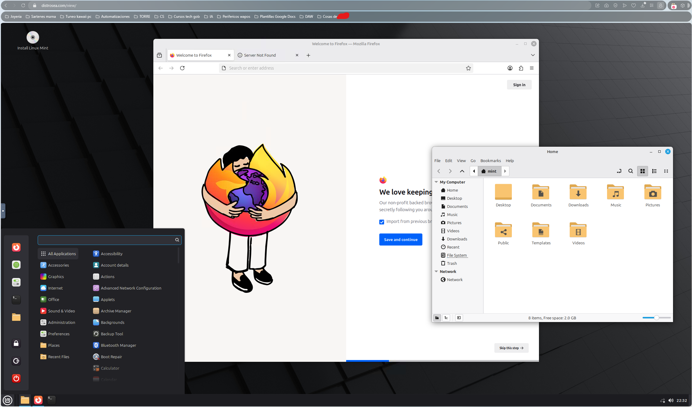

# 🐧 Fundamentos BASH  
  

> 💫 Bienvenidinchi a Fundamentos de **BASH**  
> Aquí encontrarás los comandos más usados ✨.  
> **Bash** es una herramienta base para la mayoria de distros de Linux! Es **ESENCIAL** aprenderlo ya que tiene una base muy **sólida** para trabajar con cualquier sistema de Linux 🫦

---

## 🧠 Requisitos previos

- 🐧 **Una distro de Linux**: Elige una que se adapte a tus necesidades! Si quieres probar cómo se ven diferentes distros sin bajarlas de forma online y obv **gratis** entra a este enlace: [Distros de Linux](https://distrosea.com/es/). Para que veas como se ve en mi navegador, va flama! Es **completamente funcional** para que pruebes todo todito!

  
   
  

- 🖥️ **VM**: Si solo dispones de un PC y quieres conservar tu SO actual, te sugiero buscar una Máquina Virtual. Te recomiendo la VM de Oracle ya que tiene host para todos los SOs! Para descargarlo: [Oracle VM](https://www.virtualbox.org/wiki/Downloads)
- 💻 **Cambiar de SO/Distro**: Si te sientes valiente y quieres instalar Linux nativo en tu pc (o hacer un Dual Boot junto a Windows), ole tú! 💅 Pero OJO 👀:
  1.  **Backup**: Guarda tus datos importantes en la nube o disco externo. No queremos dramas! 🛡️
  2.  **ISO**: Descarga la imagen `.iso` de la web oficial de la distro.
  3.  **Flashear USB**: Usa una herramienta como [BalenaEtcher](https://etcher.balena.io/) (super visual ✨) o [Rufus](https://rufus.ie/es/) para meter la ISO en un USB.
  4.  **BIOS/UEFI**: Tendrás que reiniciar y entrar en la BIOS (la tecla depende de tu placa base) para decirle al PC que arranque desde el USB.
  > 💡 **Tip**: Si es tu primera vez, te recomiendo seguir este tutorial paso a paso para no perderte: [Guía de instalación Dual Boot](https://www.softzone.es/windows/como-se-hace/ubuntu-windows-dual-boot/) o buscar en YT "Instalar [NombreDistro] junto a Windows". O si es directamente quemar tu SO actual y meter la distro que has elegido como tu único SO, también hay tutoriales, busca en internetes ;P

---

## 🗂️ Estructura del directorio actual

| 📁 Carpeta | 📝 Contenido | 📊 Estado |
| :--- | :--- | :---: |
| [`0.1. Hola Mundo`](./0.1.%20Hola%20Mundo/) | Lo basiquísimo para que le pierdas el miedo! | ✅ |
| [`0.2. pwd (Print Working Directory)`](./0.2.%20pwd%20(Print%20Working%20Directory)/) | Ver en qué directorio te encuentras actualmente | ✅ |
| [`0.3. cd (Change Directory)`](./0.3.%20cd%20(Change%20Directory)/) | Cambia de directorio | ✅ |
| [`0.4. ls (List Directories)`](./0.4.%20ls%20(List%20Directories)/) | Saca una lista de un directorio a tu gusto | ✅ |
| [`-`]() | - | ⏳ |

---

> 🧩 Este repositorio irá creciendo hasta completar todos los conocimientos posibles sobre este tema 🌈  
> 🖤 Hecho con cariño, café y mucho push 💅✨