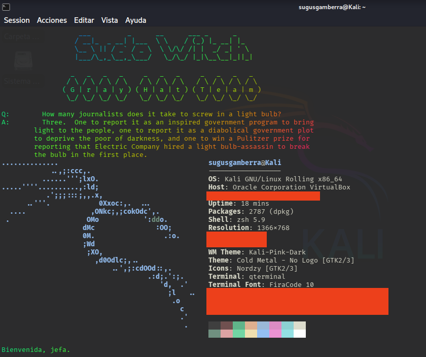
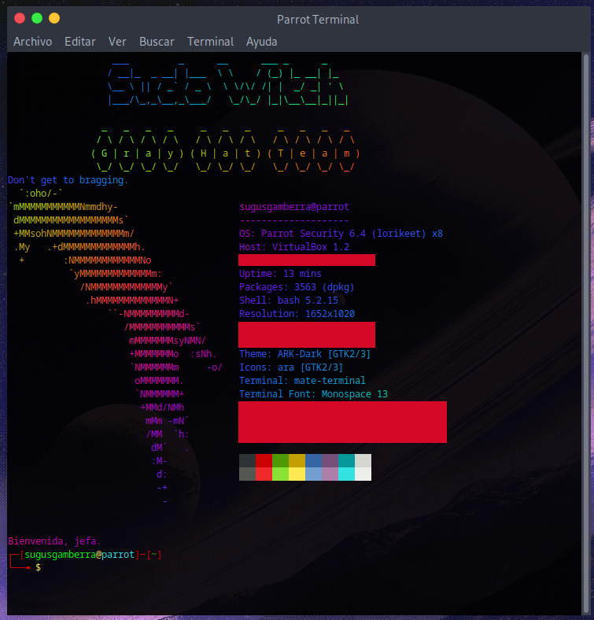

# 🎨 Tuneo de terminal Bash / ZSH en Distros de Linux
> ⚠️ Guia pensada para Ubunto/Debian y distros derivadas!!

<div>
  
  
</div>


---

Para tener una terminal **hiper waparda** como las que ves arriba lo que hice fue:

1. En la terminal escribe:
```bash
sudo apt install figlet lolcat fortune -y
```
2. Para que puedas ver las diferentes fuentes escribe:
```bash
showfigfonts
```
3. De la que te guste, memoriza su nombre, yo en mi caso escogí _small_ y _bubble_ ;D
4. Instalamos esto:
```bash
sudo apt install neofetch
```
> ⚠️ `apt` es solo para debian/ubuntu y derivadas!!
5. Con todo eso hecho... Ahora entramos, según tu terminal:
```bash
#Cuidao, si es bash elige el primer codigo y si es ZSG el segundo!!
Bash: sudo nano ~/.bashrc
ZSG: sudo nano ~/.zshrc
```
6. De ahí empieza el tuneo: Tienes que poner lo que hayas elegido al final del todo del archivo, para que veas de ejemplo:
```bash
#tuneo
figlet -f small -c "Sugus (tu nombre o mote vaya)" | lolcat
figlet -f bubble -c "Aprendiendo Bash (o un mantra, algo que te guste...)" | lolcat
fortune | lolcat
neofetch | lolcat
echo Bienvenida. | lolcat
```
7. Guarda el archivo con `Ctrl`+`x`, dale a S o Y (de sí o yes), enter y te sales. Ciera y abre la terminal para ver los cambios ;P

> ✨ **figlet**: son las fuentes wapardas
>
> ✨ **fortune**: te suelta una frase random, opcionalisimo pero queda cuco, si la terminal le cuesta abrir quitalo
> 
> ✨ **neofetch**: lo que te pone la info de tu so y pc! Esta wapisimo, pero si te tarda en abrir la terminal quitalo, mejor eficiencia q ir a puñete con tus sistemas x,D
> 
> ✨ **lolcat**: es lo que lo pone arcoiris, prueba si ciertas cosas te gustan más o menos con lolcat y sin lolcat!
> 
> ✨ **echo**: escribe lo que uieras ahí! Y si lo quieres quitar también opcionalisimo AHAHAHHA

Y ya lo tendrias tuneado :P